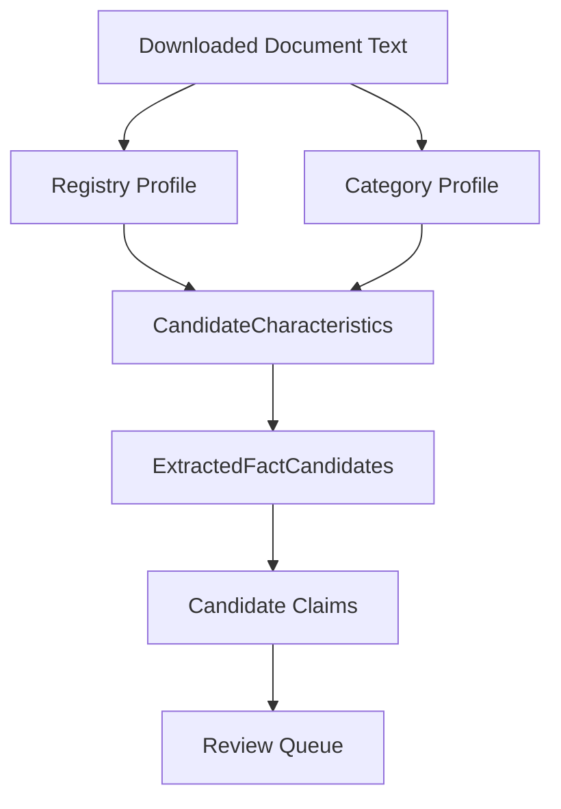

# Category Extraction Profiles

## Purpose

Category Extraction Profiles add category-aware, rule-based characteristic extraction to the CyberMedica importer pipeline.

The system does not use LLM, OCR, browser automation or inferred facts. It only extracts candidate facts from text already available to the importer and keeps all output unverified.

## Pipeline Position

## Files

Profiles live in:

`scripts/importers/catalog/extraction-profiles/`

Core files:

- `base.ts`
- `registry.ts`
- `index.ts`

Category profiles:

- `ventilator.ts`
- `ultrasound.ts`
- `anesthesia.ts`
- `patient-monitor.ts`
- `endoscopy.ts`
- `consumables.ts`
- `lighting.ts`
- `neonatal.ts`

## Interface

Every profile implements the same interface:

- `name`
- `categoryMatchers`
- `expectedFields`
- `rules`
- `matchesCategory(category)`
- `extract(input)`
- `coverage(characteristics)`

The registry always runs first. Category profiles are selected by product category.

## Supported Categories

### Ventilator

Fields:

- weight
- screen
- battery runtime
- modes
- NIV
- neonatal
- adult
- pediatric
- turbine
- oxygen

### Ultrasound

Fields:

- channels
- probe ports
- Doppler
- elastography
- 3D/4D

### Patient Monitor

Fields:

- parameters
- screen
- modules
- battery runtime

### Endoscopy

Fields:

- working channel
- diameter
- length
- sterile
- single-use

### Consumables

Fields:

- sterile
- usage
- connector
- dead space
- humidification
- filtration efficiency

### Lighting

Fields:

- illumination
- color temperature
- diameter
- sterile handle

### Neonatal

Fields:

- temperature
- humidity
- weight capacity
- oxygen
- alarms

### Anesthesia

The current anesthesia profile reuses the ventilator respiratory rules because the first pilot models overlap on ventilation-related characteristics.

## Synonyms

Each rule contains explicit synonyms. Examples:

- Mass / Weight / Device Weight / Weight kg -> `weight`
- Battery Runtime / Operating Time / Battery Duration / battery life -> `battery_runtime`
- Screen / Display / TFT display -> `screen`
- Probe ports / Transducer ports -> `probe_ports`
- Single-use / Disposable -> `single_use`

The matched synonym is recorded on every extracted characteristic as `matchedSynonym`.

## Unit Normalization

Supported normalized units:

- `kg`
- `g`
- `inch`
- `h`
- `min`
- `ml`
- `mm`
- `cm`
- `µm`
- `%`

The parsed unit is stored as `normalizedUnit`. If a unit is unknown, it remains unchanged and still requires human review.

## Confidence and Diagnostics

Each extracted characteristic includes:

- extraction profile name;
- matched pattern;
- matched synonym;
- normalized unit;
- source locator;
- rule confidence.

This information is diagnostic only. It does not affect Verification or Publication.

## Reports

Trusted extraction reports now include:

- profiles used;
- patterns matched;
- normalized units;
- failed fields;
- coverage percent.

Aggregate extraction reports include:

- profiles used across products;
- aggregated matched patterns;
- aggregated normalized units;
- average coverage percent.

## Safety Boundaries

Category Extraction Profiles cannot:

- create Verified Claims;
- approve facts;
- publish facts;
- write Supabase;
- change Review Queue logic;
- bypass human review;
- use Candidate Claims as input;
- infer facts that are not present in source text.

All extracted data remains candidate-only.

## Limitations

- Rules are intentionally conservative.
- Unit conversion is normalization only, not semantic conversion.
- Complex tables may require better text extraction before rules can match reliably.
- Coverage is a profile completeness signal, not publication readiness.
