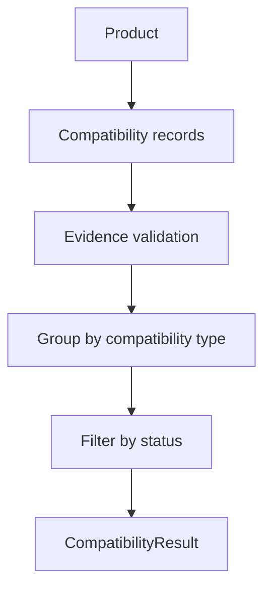

# Compatibility Model

MVP-029 introduces Compatibility Engine v1.

Compatibility in CyberMedica is an evidence-backed relationship between two
medical products. It is not a marketing list and not a simple yes/no matrix.

## Core Principle

No compatibility record can exist without evidence.

Required evidence:

- evidence ids;
- source URLs;
- document version ids;
- review status;
- last updated date;
- notes.

If documents are missing, the product surface must say:

```text
Нет подтверждённых данных.
```

## Types

### CompatibilityStatus

Supported statuses:

- `compatible`;
- `compatible_with_conditions`;
- `not_verified`;
- `not_compatible`;
- `unknown`.

### CompatibilityType

Supported relationship categories:

- `consumable_device` — расходник ↔ аппарат;
- `accessory_device` — аксессуар ↔ аппарат;
- `sensor_monitor` — датчик ↔ монитор;
- `cable_equipment` — кабель ↔ оборудование;
- `software_equipment` — ПО ↔ оборудование;
- `option_equipment` — опция ↔ оборудование.

### CompatibilityRecord

Each record contains:

- compatibility id;
- product A;
- product B;
- compatibility type;
- compatibility status;
- evidence.

### CompatibilityEvidence

Evidence contains:

- evidence ids;
- source URLs;
- document version ids;
- review status;
- last updated date;
- notes.

## Engine Flow



## Safety Boundaries

The engine must never:

- use Candidate Claims directly;
- create compatibility automatically;
- use LLM output;
- infer compatibility by analogy;
- show unverified links as confirmed facts;
- write to Supabase;
- write to `public_api`;
- change Verification or Publication;
- mutate Review Queue or Review Decisions.

## Public Display Rules

- `compatible`: show as confirmed but still evidence-scoped.
- `compatible_with_conditions`: show conditions prominently.
- `not_verified`: show as missing confirmed data, not as negative
  compatibility.
- `not_compatible`: show only when evidence explicitly supports it.
- `unknown`: show as unknown, not as compatible.

No bright success styling should be used. The visual tone should remain calm and
expert.

## Future Compatibility Graph

Future versions should add:

- bidirectional graph traversal;
- category-specific compatibility policies;
- conflict detection between documents;
- evidence excerpts and page locators;
- date/version history;
- compatibility source priority;
- product-picker integration;
- export for clinical engineering and procurement review.

