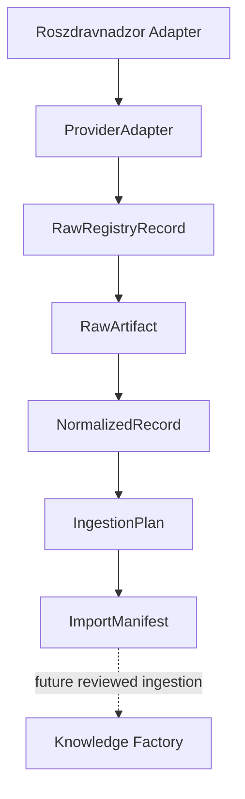

# MVP-004B Architecture Self-Audit

## Pipeline



The solid arrows exist in MVP-004B. The dotted Factory arrow is intentionally
not implemented.

## Code evidence

| Layer | Implementation |
|---|---|
| Provider-neutral contracts | `scripts/importers/core/contracts.ts` |
| Immutable raw artifacts | `core/artifact-store.ts` |
| Streaming and retry policy | `core/downloader.ts` |
| Idempotency and version chains | `core/manifest-store.ts` |
| Status rules | `core/status.ts` |
| Provider implementation | `scripts/importers/roszdravnadzor.ts` |

`ProviderAdapter` exposes only:

```text
fetchRawRecord()
normalize()
createIngestionPlan()
```

It has no dependency on Supabase, Projection, Publication, Verification or the
Claim Engine.

## ImportManifest as source of truth

The manifest is read before reconciliation. Existing Documents and
DocumentVersions are loaded into the next ingestion plan. SHA-256 determines
whether a downloaded artifact is:

- already known: no new version;
- changed under the same `documentKey`: append a version with `supersedes`;
- a different `documentKey`: create a separate logical Document.

The manifest is protected by a lock containing `pid`, `acquiredAt`,
`staleAfterMs` and a unique token. Locks older than the configured stale timeout
are removed after token revalidation.

Manifest updates use a unique `.part`, `fsync` and atomic rename.

## Magic-byte validation

`DocumentSignatureValidator` is a provider-neutral extension point.

MVP-004B validates the `%PDF-` signature for `application/pdf`. The interface
allows DOC/CFB, DOCX/ZIP and generic binary classifiers to be added without
changing provider adapters. Those additional signatures remain an explicit
MVP-2 TODO.

## Publication safety

The ingestion plan can contain only candidate facts:

```text
status: candidate
verificationStatus: unverified
autoPublish: false
```

There is no code path to Verification, Publication or Projection.

## Evidence produced by tests

The test suite verifies:

- repeated import produces one artifact and one version;
- changed bytes create a new version with `supersedes`;
- multiple PDFs create separate Documents;
- missing documents require an explicit warning;
- HTML and JSON document responses are rejected;
- invalid PDF magic bytes are rejected;
- size limit is enforced during streaming and `.part` is removed;
- retry is limited to temporary failures;
- HTTP 404 is not retried;
- stale manifest locks recover automatically.

The self-audit manifest attached to the review is generated through the same
`ContentAddressedArtifactStore` and `ImportManifestStore` used by the importer,
using deterministic local fixtures because the live provider is unavailable in
the execution environment.
