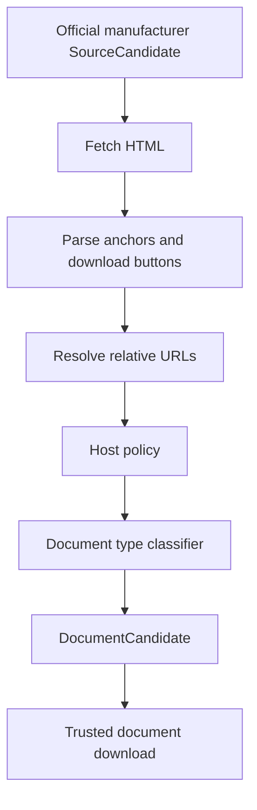

# Manufacturer Document Link Resolver

MVP-023 adds a safe resolver between official manufacturer pages and trusted document processing.

It exists because MVP-022 proved that a product page URL is not the same thing as a downloadable document URL.

## Lifecycle

## Scope

The resolver is discovery-only.

It may:

- fetch official manufacturer HTML pages;
- parse anchors;
- parse simple download buttons;
- normalize relative document URLs;
- classify document links conservatively;
- create `DocumentCandidate` records;
- report resolver warnings.

It must not:

- download documents;
- extract text;
- create candidate claims;
- create verified claims;
- publish facts;
- write to Supabase;
- use OCR;
- use LLM output;
- use snippets as facts.

## Link Detection

The resolver supports:

- direct PDF links;
- relative links;
- PDF links with query parameters;
- anchors around download buttons;
- button attributes such as `data-href`, `data-url`, and `formaction`;
- simple `window.open(...)` or `location.href = ...` handlers.

The resolver looks for document intent in URL and link text.

Recognized terms include:

- manual;
- user manual;
- operator manual;
- instructions;
- IFU;
- datasheet;
- technical specifications;
- brochure;
- specifications;
- downloads;
- documents;
- инструкция;
- руководство;
- спецификация;
- брошюра;
- документы.

To avoid false positives, a non-PDF link must also look like a document/download URL. Ordinary product, technology, social, and article links are not accepted only because their text contains a document-like word.

## Classification Policy

Classification is conservative:

- `manual`, `user manual`, `operator manual`, `Bedienungshandbuch` -> `user_manual`;
- `IFU`, `instructions for use`, `инструкция` -> `ifu`;
- `technical specification`, `technical specifications`, `datasheet`, `Technische Spezifikation`, `specification` -> `datasheet`;
- `brochure`, `leaflet`, `Broschüre` -> `brochure`;
- `certificate`, `declaration`, `сертификат` -> `certificate`;
- `service manual` -> `service_manual`;
- uncertain links -> `unknown` with warning.

Unknown document type is still candidate-only and requires human review.

## Host Policy

A resolved document URL is accepted only when it is:

- HTTPS;
- public, not localhost/private network;
- on the same official host as the parent source;
- or on a known manufacturer-owned host;
- or on an explicitly allowed host passed to the resolver.

Rejected links are kept as warnings.

Examples of rejected links:

- social profiles;
- marketplace pages;
- unrelated scientific publication links;
- random CDN/document hosts not tied to the manufacturer.

## Report Fields

Product discovery reports include:

- `resolvedDocumentLinks[]`;
- `resolverWarnings[]`;
- `documentTypeGuess`;
- `parentSourceId`;
- `linkText`;
- `resolvedFromUrl`.

Aggregate discovery reports include:

- `resolvedDocumentLinksFound`;
- `productsWithResolvedDocuments`;
- `productsStillMissingDocuments`.

## Relation To Trusted Document Processing

The resolver creates only `DocumentCandidate` records. Trusted document processing still owns:

- download;
- MIME validation;
- PDF magic-byte validation;
- SHA-256;
- content-addressed storage;
- document versioning;
- text extraction;
- candidate claim handoff.

The resolver improves the input quality for MVP-022 without weakening the Publication or Verification boundaries.

## Safety Boundaries

Resolved links are not evidence.

A resolved link becomes useful only after:

- safe download;
- artifact hashing;
- document version creation;
- text extraction;
- human review.

Even then, no fact is published automatically.
