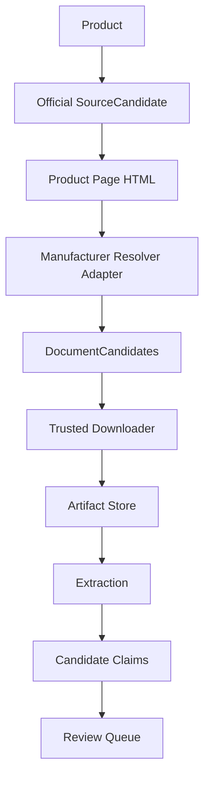

# Official Document Resolver v2

## Purpose

Official Document Resolver v2 improves discovery of manufacturer documents without changing the CyberMedica verification, publication, review queue, Supabase or public portal boundaries.

The resolver only creates `DocumentCandidate` records from official manufacturer sources. It never creates Verified Claims, never publishes facts and never writes to Supabase.

## Pipeline Position

## Resolver Framework

Resolver files live in:

`scripts/importers/catalog/document-resolvers/`

Adapters:

- `hamilton.ts`
- `mindray.ts`
- `ambu.ts`
- `drager.ts`
- `philips.ts`
- `ge.ts`
- `default.ts`

Shared framework:

- `interface.ts`
- `base-resolver.ts`

The legacy import path remains:

`scripts/importers/catalog/document-link-resolver.ts`

This keeps the existing discovery pipeline API stable while routing manufacturer-specific behavior through adapters.

## Generic Discovery Rules

The resolver looks for official links containing:

- pdf
- download / downloads
- resource / resources
- document / documents
- manual
- operator
- instructions
- IFU
- datasheet
- brochure
- technical
- catalogue / catalog
- support
- library
- media
- attachment

Direct PDF links are accepted when they are safe, public and same-host or manufacturer-host allowed.

Non-PDF pages are accepted only when the URL itself looks like a document, download, resource, support, library, media or attachment section. This prevents ordinary feature pages with words like "manual ventilation" from becoming document candidates.

## Manufacturer Rules

### Hamilton

Priority terms:

- Documentation
- Downloads
- Technical Data
- Technical specifications

### Mindray

Priority terms:

- Resources
- Support
- Downloads
- Safety Information
- Clinical Information

### Ambu

Priority terms:

- Documents
- Downloads
- IFU
- Instructions

### Dräger

Priority terms:

- Downloads
- Media Center
- Manuals

### Philips

Priority terms:

- Documentation
- Downloads
- Instructions
- Support

### GE Healthcare

Priority terms:

- Support
- Resources
- Library
- Downloads

## Document Classification

Resolver v2 classifies:

- Brochure
- Datasheet
- IFU
- Operator Manual
- Quick Guide
- Service Manual
- Technical Specification
- Clinical Information
- Software
- Safety Information
- Unknown

The current `DiscoveryDocumentType` remains unchanged. New labels such as Safety Information, Clinical Information, Software and Quick Guide are stored in candidate reasons and mapped conservatively to the closest existing candidate type:

- Quick Guide -> `user_manual`
- Clinical Information -> `brochure`
- Safety Information -> `unknown`
- Software -> `unknown`

This preserves schema compatibility and prevents accidental publication semantics.

## Confidence Model

Confidence is resolver-local and does not affect publication.

| Evidence shape | Resolver confidence |
| --- | ---: |
| Official PDF | 100 |
| Official download page | 95 |
| Official documentation/resource section | 90 |
| Official product page link | 80 |
| Regional official page | 70 |

The numeric value is stored in `DocumentCandidate.confidence` as `0.70` to `1.00`. The original percentage is also written to `reasons` as `resolver_confidence:<value>`.

## Retry Chain

If a product page does not expose direct PDFs, Resolver v2 inspects first-hop official pages whose links suggest:

1. Downloads
2. Resources
3. Support
4. Media
5. Library
6. Documentation

The retry is limited to official same-host or allowed manufacturer hosts and capped to a small number of pages. It uses normal HTTP fetch only. No browser automation, Selenium, Playwright, OCR or LLM is used.

## Deduplication

Resolver v2 deduplicates by canonical URL and document type. It removes tracking parameters such as `utm_*`, `fbclid` and `gclid`.

Content-addressed deduplication still belongs to the trusted downloader and Artifact Store. If EN/UK/US/Global or versioned URLs download to the same hash, the downloader/artifact layer prevents duplicate artifacts.

## Reporting

The existing discovery report schema is preserved. Resolver v2 writes diagnostics into `resolverWarnings`:

- resolver used;
- attempts;
- matched links;
- classified document counts;
- confidence distribution;
- duplicates removed.

This keeps reporting visible in generated JSON without adding a migration.

## Safety Boundaries

Resolver v2 cannot:

- create Verified Claims;
- approve facts;
- publish documents or facts;
- write to Supabase;
- change Review Decisions;
- bypass the Review Queue;
- use Candidate Claims as input;
- use LLM, OCR or browser automation.

Every output remains a candidate requiring download, hashing, extraction and human review.

## Limitations

- Some manufacturer sites hide documents behind dynamic widgets that plain HTTP cannot fully inspect.
- Non-PDF download pages may still require a later downloader improvement.
- Classification is conservative and may label uncertain documents as `unknown`.
- Resolver confidence is not evidence confidence and must not be used for publication decisions.
