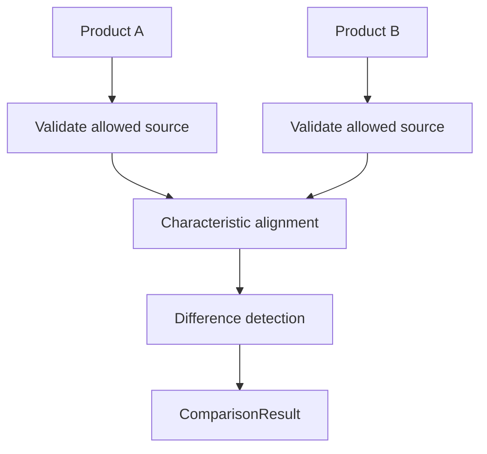

# Product Comparison Model

MVP-027 introduces the first Product Comparison Engine for CyberMedica.

The comparison model is designed for expert medical-device review, not
marketing comparison.

## Goal

A comparison row must preserve the knowledge chain behind each value:

- value;
- status;
- source;
- document version;
- evidence ids;
- confidence;
- last updated date.

The engine must never treat unverified candidate data as a public fact.

## Data Boundary

Allowed comparison sources:

- `published_knowledge`;
- `publication_ready_report`.

Forbidden as direct comparison input:

- Candidate Claims;
- extraction snippets;
- discovery candidates;
- search snippets;
- LLM-generated values.

Candidate Claims may only become comparison input after the established Review,
Verification and Publication boundaries have prepared an allowed knowledge
surface.

## Core Types

### ComparisonProduct

Represents one comparable product:

- product id;
- slug;
- title;
- manufacturer;
- model;
- category;
- data source;
- characteristics.

### ComparisonValue

Represents one value in the table:

- value;
- unit;
- status;
- source;
- document version;
- evidence ids;
- confidence;
- last updated date.

### ComparisonEvidence

Preserves provenance:

- source id, title, URL and type;
- document version id, title, version label and hash;
- evidence ids.

### ComparisonRow

Aligns the same characteristic across two products and records:

- left value;
- right value;
- difference type;
- notes.

Difference types:

- `same`;
- `different`;
- `missing`;
- `unit_mismatch`;
- `status_mismatch`.

Missing data is not counted as a difference. It is shown explicitly as absent
confirmed knowledge.

### ComparisonResult

Contains:

- compared products;
- aligned rows;
- summary metrics;
- safety warnings.

## Engine Flow

## Difference Rules

- Same key and same normalized value: `same`.
- Same key and different normalized value: `different`.
- Missing value on either side: `missing`.
- Different units: `unit_mismatch`.
- Different verification/publication status: `status_mismatch`.

The MVP does not convert units automatically. If units differ, the row is
flagged and left for future normalization.

## Current MVP Source

The first UI uses a mock/report layer for:

- Hamilton T1;
- Hamilton C1.

The pilot values are marked as `publication_ready_report`, not as published
facts.

## Safety Boundaries

The Product Comparison Engine must not:

- read Candidate Claims directly;
- create Verified Claims;
- publish facts;
- write to Supabase;
- write to `public_api`;
- merge values from conflicting sources automatically;
- infer missing data;
- hide document or source provenance.

## Future Compare Engine

Future versions should add:

- selectable products;
- category-specific characteristic templates;
- unit normalization with explicit conversion provenance;
- conflict-aware rows;
- side-by-side evidence excerpts;
- filters by group, difference and status;
- export for procurement and clinical review;
- integration with the verified/publication-ready knowledge surface.

