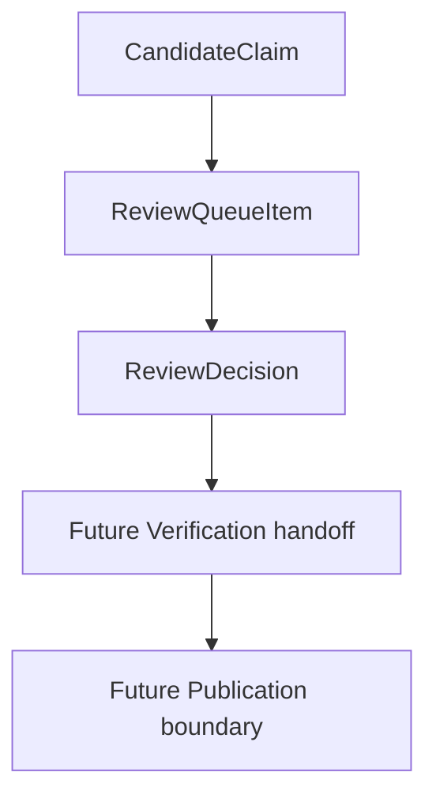

# Review Decision Model

MVP-026 adds a file-level prototype for reviewer decisions over Review Queue
items.

The model is intentionally narrow:

- no Supabase writes;
- no Verified Claims;
- no Publication records;
- no public API writes;
- no public Portal access.

## Purpose

The Review Decision layer records what a human reviewer thinks should happen
next with a `ReviewQueueItem`.

It does not change the item itself and does not change publication state.



## ReviewDecision

```ts
interface ReviewDecision {
  decisionId: string;
  reviewItemId: string;
  decision:
    | "approve"
    | "reject"
    | "request_more_evidence"
    | "mark_conflict";
  reviewer: string;
  notes: string;
  decidedAt: string;
  source: "manual_json" | "future_ui" | "test_fixture";
}
```

### Decisions

| Decision | Meaning | Safety boundary |
| --- | --- | --- |
| `approve` | The candidate fact may be handed to a future Verification step. | Not Verification, not Publication. |
| `reject` | The candidate fact should not proceed without a new review. | Requires reviewer notes. |
| `request_more_evidence` | More evidence is needed before review can continue. | Requires reviewer notes. |
| `mark_conflict` | The candidate fact conflicts with other evidence or claims. | Requires reviewer notes. |

## ReviewDecisionSummary

```ts
interface ReviewDecisionSummary {
  totalDecisions: number;
  approved: number;
  rejected: number;
  moreEvidenceRequested: number;
  conflictsMarked: number;
  decisionsWithoutQueueItem: number;
  queueItemsWithoutDecision: number;
}
```

The summary exists for reviewer workflow visibility only.

## Input

Manual decisions are read from:

```text
data/research/review/decisions.manual.json
```

The file has this shape:

```json
{
  "decisions": []
}
```

An empty file is valid. It means no reviewer decision has been recorded.

## Output

The processor writes:

```text
data/research/review/review-decisions.generated.json
```

The generated report contains:

- valid decisions;
- summary metrics;
- invalid decisions with reasons;
- queue items with decisions;
- queue items without decisions;
- warnings.

The processor does not mutate:

- `review-queue.generated.json`;
- product-level Review Queue reports;
- generated catalog data;
- Supabase;
- public API data;
- Verification or Publication state.

## Validation

Validation is conservative.

- Unknown `reviewItemId` makes the decision invalid.
- Duplicate decisions for the same `reviewItemId` are rejected.
- `approve` is accepted only when the queue item has evidence ids and document
  version ids.
- `reject`, `request_more_evidence` and `mark_conflict` require notes.
- `reviewer` is required.
- `decidedAt` is required.
- `source` must be explicit.

The safe duplicate policy is rejection. The processor does not silently choose
the latest decision because that would hide audit-trail ambiguity.

## Why Approve Is Not Verification

`approve` means:

> The reviewer believes this candidate can proceed to a future Verification
> handoff.

It does not mean:

- the fact is verified;
- the fact is published;
- the Portal can show it;
- Supabase was updated;
- Publication was triggered.

Verification must remain a separate controlled step. Publication must remain a
separate explicit boundary after Verification.

## Audit Trail

Each decision records:

- stable decision id;
- linked Review Queue item;
- reviewer identity;
- notes;
- decision time;
- source of the decision.

For MVP-026 the audit trail is file-level only. Future persistent storage must
preserve the same fields and must not collapse Review, Verification and
Publication into one action.

## Safety Boundaries

The Decision Model must never:

- create Verified Claims;
- create Publication records;
- write to Supabase;
- write to `public_api`;
- change public Portal pages;
- update generated catalog data manually;
- let the Portal read Review Queue or decisions directly;
- treat LLM output as reviewer approval.

