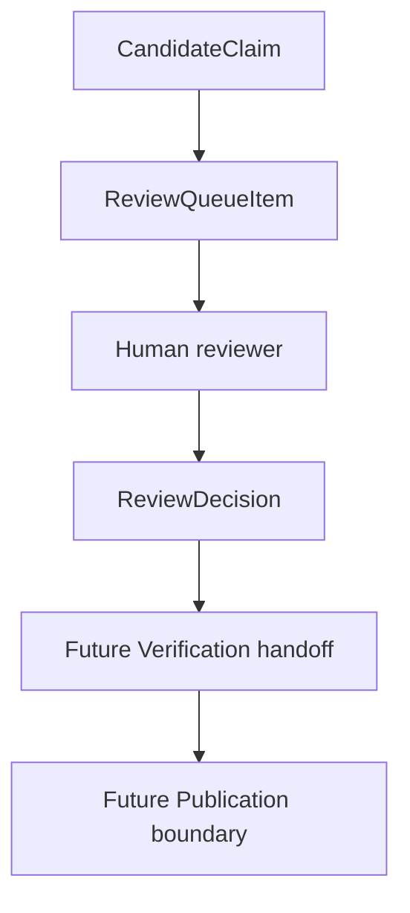

# Review Queue Model

MVP-024 introduces the first candidate-only Review Queue layer for CyberMedica.

The Review Queue is not Verification, not Publication, and not a public data source.

## Lifecycle

## ReviewQueueItem

A `ReviewQueueItem` is created from one `CandidateClaim` when evidence exists.

Fields:

- `reviewItemId`
- `productSlug`
- `productTitle`
- `claimCandidateId`
- `suggestedClaimType`
- `valuePayload`
- `evidenceCandidateIds[]`
- `documentVersionIds[]`
- `sourceUrls[]`
- `status`
- `priority`
- `riskLevel`
- `reasons[]`
- `reviewerNotes`
- `createdAt`
- `updatedAt`

A Review Queue item is still candidate data. It is never a Verified Claim.

## Statuses

- `pending_review`: ready for human assessment or awaiting more evidence context.
- `needs_more_evidence`: reviewer decided that evidence is insufficient.
- `approved_for_verification`: reviewer thinks the claim can move to a future Verification handoff.
- `rejected`: reviewer rejected the candidate.
- `conflict`: reviewer marked a conflict that must be resolved outside automatic extraction.

MVP-024 creates only `pending_review` items. Other statuses are modeled for future manual workflows.

## Risk Levels

- `high`: compatibility, clinical, procurement, safety, warnings, contraindications, risk, and registration-sensitive claims.
- `medium`: identity claims such as manufacturer and model, or claims where evidence is present but context is incomplete.
- `low`: document metadata and low-level extracted technical terms.

## Priority

- `critical`: high-risk clinical, safety, compatibility, or procurement claims.
- `high`: registration and identity claims, or items missing linked document versions.
- `medium`: ordinary candidate facts requiring review.
- `low`: reserved for low-impact future metadata.

Priority does not imply correctness.

## ReviewDecision

A `ReviewDecision` records a human action:

- `approve`
- `reject`
- `request_more_evidence`
- `mark_conflict`

The decision includes reviewer identity, notes, and decision time.

A decision does not:

- publish data;
- create a Verified Claim;
- write to Supabase;
- update `public_api`;
- bypass Verification.

## Relationship To Verification

The Review Queue prepares candidate claims for future Verification handoff.

`approved_for_verification` means only that a human reviewer thinks the candidate is worth verification. It is not the same as `verified`.

## Relationship To Publication

Publication remains a separate boundary.

The Portal must not read Review Queue directly. Public pages must only read published, verified data from the established publication surface.

## Safety Boundaries

The Review Queue must never:

- auto-approve claims;
- auto-verify claims;
- auto-publish claims;
- write to Supabase;
- write to `public_api`;
- mutate Verification or Publication state;
- resolve conflicts automatically;
- treat reviewer decisions as public facts.

The queue operates only on candidate reports under `data/research`.
