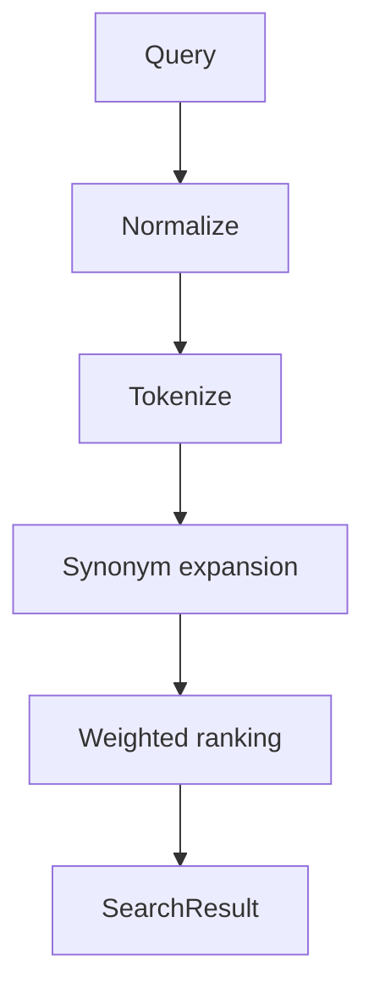

# Search Model

MVP-028 introduces a deterministic search layer for CyberMedica.

This is not AI search. It does not infer facts and does not read internal
review data.

## Searchable Fields

The index supports:

- manufacturer;
- product name;
- model;
- category;
- registration number;
- SKU / article;
- aliases;
- synonyms;
- abbreviations.

## Data Sources

Allowed MVP sources:

- published product data;
- publication-ready mock/report data used by approved prototypes.

Forbidden direct sources:

- Candidate Claims;
- Review Queue;
- extraction snippets;
- discovery candidates;
- `public_api` internals;
- Supabase write surfaces.

The index deliberately filters out `candidate_claim` documents.

## Engine Flow

## Normalization

The engine:

- lowercases text with Russian locale;
- normalizes `ё` to `е`;
- removes punctuation except medically useful separators;
- collapses whitespace;
- tokenizes multi-word queries.

## Ranking

Priority order:

1. exact model match;
2. registration number;
3. manufacturer;
4. product name;
5. category.

Additional lower weights are used for SKU, aliases and synonyms.

Tie-breaking is deterministic by product title.

## SearchResult

Each result contains only public-facing fields:

- title;
- manufacturer;
- category;
- model;
- verification/publication status;
- last updated date;
- href;
- matched fields.

Internal identifiers are not displayed as user-facing facts.

## Safety Boundaries

Search must not:

- search Candidate Claims directly;
- show unverified values as facts;
- read Review Queue;
- write to Supabase;
- publish data;
- mutate Verification or Publication state;
- use LLM ranking.

## Future Search

Future versions can add:

- category-specific synonym dictionaries;
- typo tolerance;
- keyboard layout normalization;
- verified evidence snippets;
- filters by category, manufacturer and status;
- analytics over anonymous search terms;
- integration with a final published search datastore.

