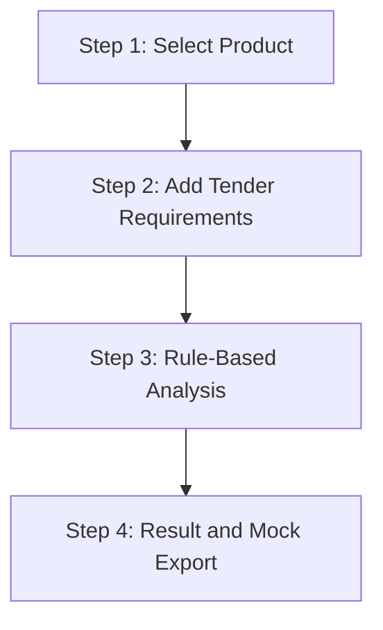

# Tender Assistant v2

## Purpose

Tender Assistant v2 turns the first tender compliance prototype into a practical procurement workflow. It remains deterministic and rule-based.

It does not use AI, LLM, Candidate Claims, Review Queue data, Supabase writes, Verification or Publication.

## Workflow

## Product Scope

The current UI uses published projection products only:

- Hamilton T1
- Hamilton C1
- Mindray A5
- Mindray A7
- FS510

Products are represented in `lib/tender/mock-data.ts` as `PublishedTenderProduct` records. Candidate sources are ignored by the engine and cannot satisfy a requirement.

## Rule Editor

The UI supports 5-10 manually entered requirements. Each requirement has:

- characteristic key;
- visible label;
- category;
- rule operator;
- expected value;
- unit.

Supported operators:

- `>=`
- `<=`
- `=`
- Boolean
- Enum
- Contains
- Text exact

## Result Model

For every requirement the engine returns:

- requirement;
- product value;
- status;
- source;
- document;
- last update;
- notes.

Statuses:

- `matches` - соответствует;
- `does_not_match` - не соответствует;
- `not_verified` - нет подтверждённых данных;
- `partially_matches` - частичное текстовое совпадение, нужна экспертная проверка;
- `unknown` - правило нельзя проверить детерминированно.

## Risk Level

Risk is calculated from deterministic summary counts:

- `High` if at least one requirement does not match;
- `High` if 40% or more requirements have no confirmed data or unknown status;
- `Medium` if there is any missing or unknown data below the 40% threshold;
- `Low` if all requirements match and no data is missing.

## Export

The current "Скачать отчёт" control is a UI mock. It does not generate PDF, does not write files and does not publish results.

## Safety Boundaries

Tender Assistant v2 cannot:

- read Candidate Claims as facts;
- read Review Queue data;
- write Supabase;
- create Verified Claims;
- publish compliance results;
- change Verification or Publication.

The assistant is a procurement analysis surface over published projection data only.

## Future Work

- Real PDF export after legal/privacy review.
- Upload/import of structured tender requirements.
- Product comparison inside tender result.
- Evidence drill-down into document locators.
- Reviewer-approved product values as the future production data source.
