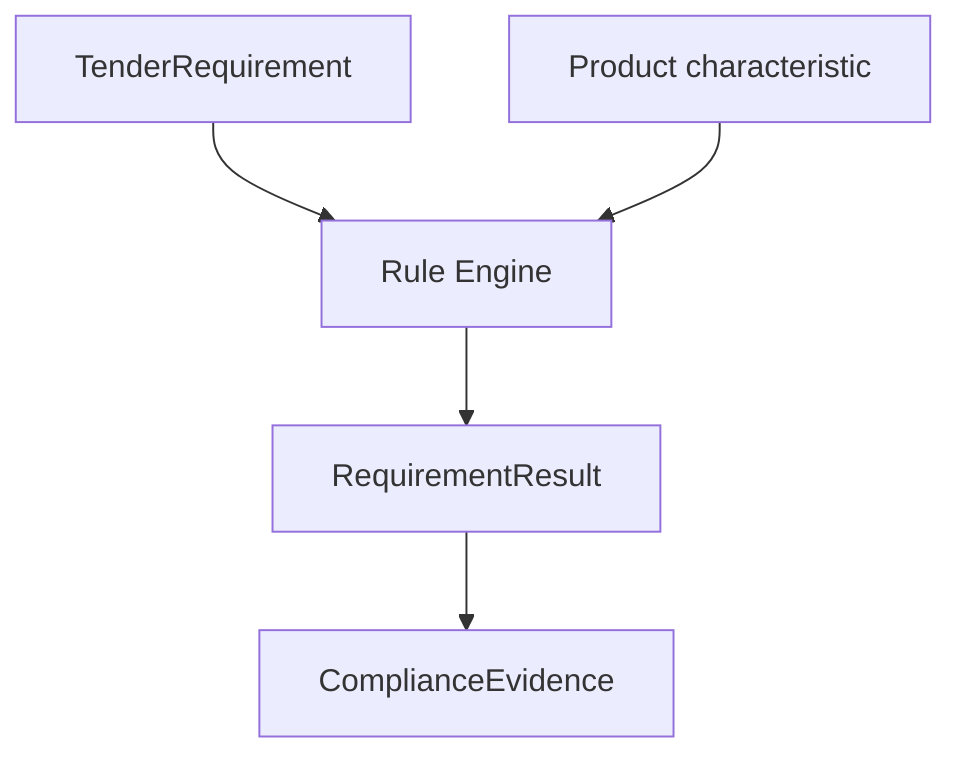

# Tender Compliance Model

MVP-030 introduces Tender Compliance Engine v1.

The engine checks whether a medical device characteristic satisfies a technical
requirement. It does not generate tender documents and does not publish results.

## Flow



## Core Types

### TenderRequirement

Represents one requirement from a technical specification:

- requirement id;
- label;
- category;
- operator;
- expected value;
- unit.

### RequirementResult

Represents the result for one requirement:

- requirement;
- product value;
- status;
- actual value;
- expected value;
- evidence;
- notes.

### ComplianceEvidence

Every verified result must preserve:

- source;
- document version;
- evidence ids;
- last updated date.

Without evidence the result is always `not_verified`.

### ComplianceResult

Aggregates all requirement results for one product and one tender.

## Statuses

- `matches`;
- `does_not_match`;
- `partially_matches`;
- `not_verified`;
- `unknown`.

## Supported Rules

MVP-030 supports deterministic checks only:

- numeric `>=`;
- numeric `<=`;
- numeric `=`;
- boolean;
- enum;
- string exact;
- string contains.

No LLM, no analogy and no free-text inference are used.

## Evidence Boundary

The engine must not satisfy a requirement from:

- Candidate Claims;
- unverified extraction output;
- search snippets;
- LLM-generated text;
- missing evidence.

If evidence is absent, the public result is:

```text
Нет подтверждённых данных
```

## Safety Boundaries

The engine must never:

- use Candidate Claims directly;
- create Verified Claims;
- publish results;
- write to Supabase;
- write to `public_api`;
- mutate Review Queue or Review Decisions;
- change Verification or Publication state;
- infer a requirement by analogy.

## Future v2

Future versions should add:

- tender file parsing into candidate requirements;
- human review of parsed requirements;
- unit conversion with explicit conversion provenance;
- category-specific rule templates;
- conflict handling;
- exportable compliance reports;
- side-by-side evidence excerpts;
- integration with a verified/publication-ready product knowledge surface.

