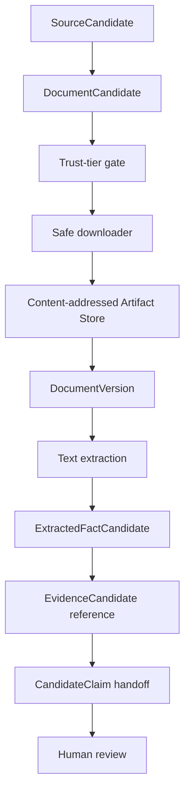

# Trusted Document Processing

MVP-022 adds a candidate-only bridge between Source & Document Discovery and the future Review Queue.

It does not publish facts, does not create verified claims, and does not write to Supabase.

## Lifecycle



## Download Gate

Only document candidates from allowed trust tiers enter the download step.

- Tier 1 and Tier 2 can be downloaded as candidates.
- Tier 3 and Tier 4 are skipped for trusted processing.
- Skipped documents are reported, not silently ignored.
- A document remains candidate-only even after a successful download.

The downloader enforces:

- HTTPS URL allowlist per document host.
- MIME validation.
- PDF magic-byte validation.
- SHA-256 calculation.
- Content-addressed storage.
- File size limit.
- `.part` cleanup on failure.
- No overwrite of existing content-addressed artifacts.
- Duplicate URL and document-type dedupe.
- Non-fatal failed downloads.

## Artifact Storage

Artifacts are stored under:

```text
data/research/artifacts/artifacts/sha256/<aa>/<bb>/<sha256>.<ext>
```

The SHA-256 hash is the identity of the downloaded bytes.

The pipeline creates `DocumentVersion` records in generated reports only. These are not database records and are not publication records.

## Document Versioning

A `DocumentVersion` binds:

- product slug;
- document candidate id;
- source id;
- document type;
- document URL;
- language candidate;
- SHA-256;
- content type;
- byte size;
- artifact path.

The version id is deterministic from document key and SHA-256.

## Extraction Rules

Extraction is intentionally conservative.

Allowed:

- PDF text extraction through local text tools when available.
- Plain rule-based parsing.
- Metadata extraction for document title, language, and document type.
- Basic technical terms only when explicitly present in extracted text.

Not allowed:

- OCR.
- LLM extraction.
- Inference from search snippets.
- Inference from marketing page summaries.
- Filling missing values.

If text cannot be extracted, the product-level report stores a warning and the run continues.

## Extracted Facts

`ExtractedFactCandidate` is not a verified fact.

Each extracted fact must preserve:

- source URL;
- document version id;
- document SHA-256;
- locator;
- raw text;
- extraction method;
- confidence;
- `verificationStatus: unverified`;
- `autoPublish: false`;
- `requiresHumanReview: true`.

## Candidate Claim Handoff

A `CandidateClaim` is created only when an extracted fact has an evidence candidate id and document hash.

Candidate claims:

- have `autoPublish: false`;
- have `verificationStatus: unverified`;
- require human review;
- reference evidence candidate ids;
- do not embed full evidence;
- do not create verified claims.

## Reports

Generated reports:

- `data/research/documents/download-report.generated.json`
- `data/research/documents/products/<slug>.json`
- `data/research/extraction/extraction-report.generated.json`
- `data/research/extraction/products/<slug>.json`

Reports are deterministic for identical downloaded bytes and discovery inputs.

## Safety Boundaries

The processing layer must never:

- publish facts;
- create verified claims;
- write to Supabase;
- write to `public_api`;
- bypass Verification;
- bypass Publication;
- use Tier 3 or Tier 4 documents as trusted processing input;
- use LLM output as evidence;
- treat downloaded bytes as proof without review;
- resolve conflicting facts automatically.

## What Is Still Not Verified

A successful MVP-022 run proves only that:

- a document candidate was downloadable;
- the bytes passed safety checks;
- the artifact was hashed and stored;
- text extraction produced candidate text;
- candidate facts can be handed to review.

It does not prove that:

- the document is the correct document for the product;
- the document is current;
- the extracted fact is accurate;
- the fact can be published;
- compatibility, accessories, or risks are validated.
