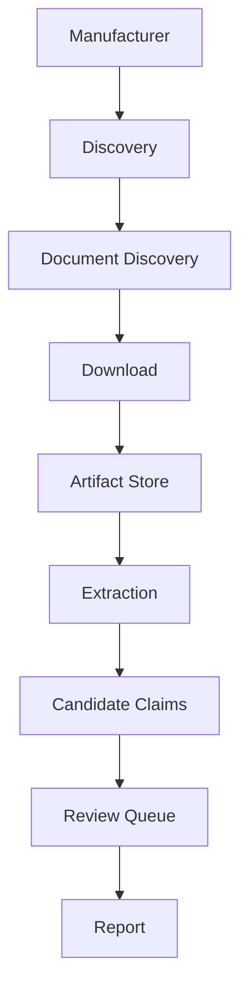

# Wave 2 Execution Model

Дата: 2026-07-09

## Назначение

Wave 2 Execution Engine — безопасный orchestration layer для подготовки расширения базы CyberMedica до 250-300 изделий. Он запускает этапы в правильном порядке и создаёт отчёты, но не публикует данные и не меняет Verification/Publication.

## Command

```bash
npm run wave2:execute -- Hamilton
npm run wave2:execute -- all
```

Поддерживаются:

- Hamilton;
- Mindray;
- Ambu;
- Drager;
- SonoScape;
- Comen;
- SLE;
- Dixion;
- GE;
- Philips.

## Pipeline



## Current MVP Behavior

MVP-035 uses mock/manual providers only:

- manual source seeds from `data/research/source-seeds.manual.json`;
- deterministic stage metrics;
- generated JSON reports;
- no network crawling beyond existing architecture;
- no Supabase;
- no Publication;
- no Review Decisions.

## Reports

Per manufacturer:

`data/research/wave2/<Manufacturer>/summary.generated.json`

Aggregate:

`data/research/wave2/wave2-summary.generated.json`

Manufacturer summary fields:

- products discovered;
- official sources;
- documents found;
- downloads;
- artifacts;
- candidate facts;
- review items;
- blocked products;
- errors;
- warnings;
- duration;
- retries;
- stages.

Aggregate report includes totals and explicit safety flags.

## Retry Model

Retry exists only for safe stages:

- Discovery;
- Documents;
- Downloads as a report-count step in this MVP;
- Artifact Store report step;
- Extraction mock step;
- Review Queue handoff report step.

The orchestrator does not weaken downloader rules, TLS rules, PDF validation, artifact identity or Review Queue boundaries.

## Safety Boundaries

Wave 2 execution must never:

- create verified claims;
- create publication artifacts;
- write to Supabase;
- write to public API;
- process Review Decisions;
- alter Candidate generation;
- alter Verification;
- alter Publication.

## Extension Points

Future versions can replace mock counts with real outputs from:

- existing source discovery;
- document link resolver;
- trusted document downloader;
- artifact store;
- extraction reports;
- review queue builder.

Each replacement must preserve the same report contract and safety flags.
