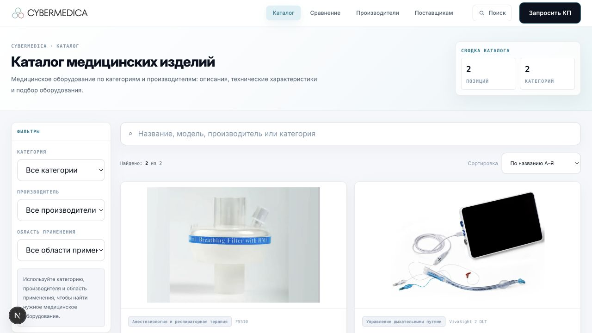
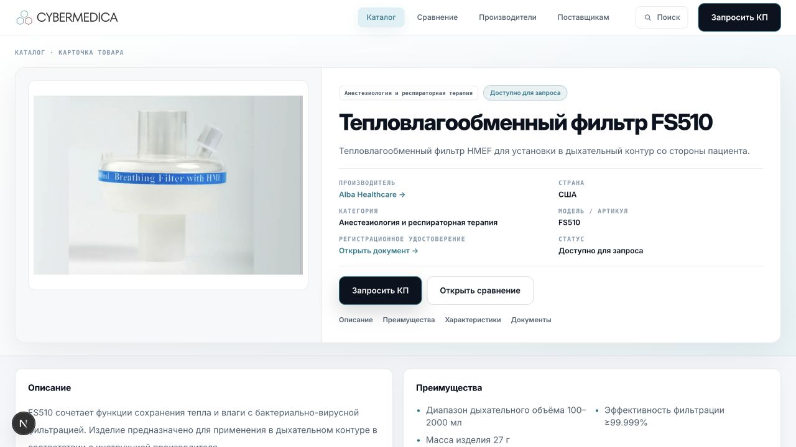
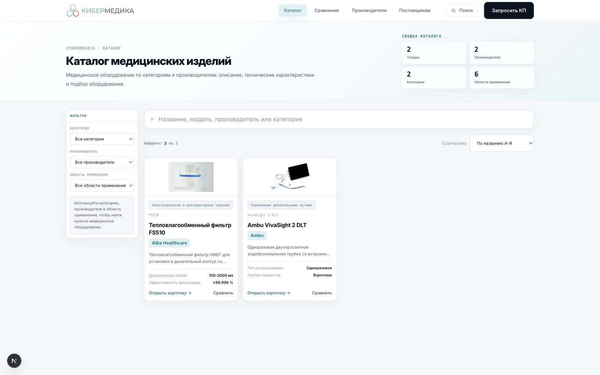
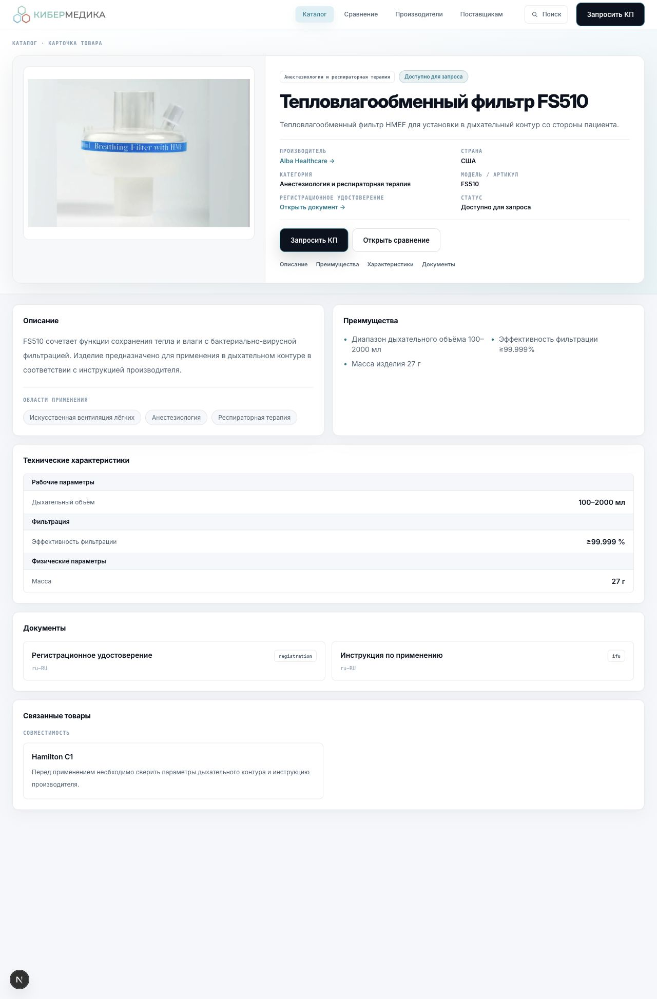

# CyberMedica — Release 0.2 PR2

**Тема:** Catalog Density & Information Hierarchy
**Дата проверки:** 2026-07-21
**Scope:** публичный Storefront поверх Catalog Baseline v1
**Статус:** реализовано, QA пройден

## Результат

PR2 повышает плотность каталога, не меняя Product Data, Storefront API или бизнес-логику. Пустые продуктовые секции остаются fail-closed и автоматически появляются только при наличии соответствующих публичных данных.

### Каталог

- фильтры уменьшены до 32 px по высоте, текст и внутренние отступы уплотнены;
- desktop-сетка использует четыре колонки при достаточной ширине, tablet — три, mobile — одну;
- preview карточки уменьшен до пропорции `16 / 6.5`, изображения сохраняют `object-contain`;
- padding карточки уменьшен с 16 до 12 px, сокращены межблочные интервалы и типографика;
- производитель выделен отдельным контрастным кликабельным элементом;
- `Категория уточняется` заменено на нейтральное `Данные уточняются` без изменения условия показа;
- summary теперь показывает четыре лёгкие storefront-метрики: товары, производители, категории и области применения.

Фактическая responsive-проверка:

| Viewport | Колонки | Карточка | Preview |
|---|---:|---:|---:|
| 1600 px | 4 | 251 px | 101 px |
| 900 px | 3 | 276 px | responsive |
| 390 px | 1 | 358 px | responsive |

Фильтр категории проверен в браузере: выбор `Управление дыхательными путями` сократил выдачу с двух карточек до одной.

### Пустые секции

Единый `ProductPresentation` продолжает управлять видимостью:

- `Преимущества` — только при наличии `keyFeatures`;
- `Документы` — только при наличии `documents`;
- `Комплектация` — только при наличии документа типа `accessories`;
- `Связанные товары` — только при наличии compatibility или `relatedProductIds`;
- `Сравнение` и RFQ — только для коммерчески готовой карточки; в Cloud Preview сравнение дополнительно остаётся отключённым.

Исходные поля товара не изменяются и фиктивный контент не создаётся.

## Manufacturer Reference Data Audit

Проверены все 25 canonical manufacturers в `data/reference/manufacturers.json`:

- 25/25 уникальных slug;
- 25/25 ISO 3166-1 alpha-2 country code;
- 25/25 HTTPS official website;
- 25/25 имеют хотя бы одно подтверждение `official_website`;
- конфликтов alias и дублирующихся slug не найдено;
- `logo = null` сохранён для всех 25 записей: отсутствие логотипа является действующей rights-review политикой, а не ошибкой данных.

### Найденные и проверенные расхождения

| Производитель | Проверка | Результат |
|---|---|---|
| Hamilton Medical | Страна, юридическое название, сайт, headquarters | В текущем Master Data уже зафиксировано `CH`, `Hamilton Medical AG`, Бонадуц, Швейцария. Официальный [Imprint Hamilton Medical](https://www.hamilton-medical.com/en_US/Imprint.html) подтверждает адрес и страну. Ошибочное `CN` в актуальном reference-файле отсутствует; Cloud/Production в этом PR не изменялись. |
| DIXION | Страна, официальный сайт | `DE` подтверждён официальной [страницей контактов DIXION](https://dixion.de/de/kontakt/). |
| Huntleigh | Страна, название, headquarters | `GB` и Huntleigh Healthcare Ltd подтверждены официальной [страницей компании](https://www.huntleigh-diagnostics.com/about-us/who-we-are-what-we-do/). |

Новых недостоверных значений, которые можно безопасно исправить в рамках PR2, не найдено. Поэтому Reference Data не переписывались и импорт в Cloud не выполнялся.

## Новый логотип

Источник: утверждённый пользователем `Logo.jpg`.

Подготовлены:

- `public/brand/cybermedica-logo.png` — прозрачный кириллический wordmark, 1400 × 293 px;
- `app/favicon.ico` — квадратный знак из трёх шестиугольников, набор размеров до 256 × 256 px.

Лишнее белое поле исходного JPG удалено, пропорции и фирменные цвета сохранены. Header загружает бренд-ассет eagerly с высоким приоритетом; Footer показывает оригинальные цвета на белой подложке без инверсии и растяжения.

## Screenshots

### До

### После

## Изменённые файлы PR2

- `app/catalog/page.tsx`
- `app/favicon.ico`
- `app/globals.css`
- `components/catalog/CatalogExplorer.tsx`
- `components/home/Footer.tsx`
- `components/layout/Header.tsx`
- `lib/storefront/product-presentation.ts`
- `public/brand/cybermedica-logo.png`
- `tests/importers/release-0.2-pr2.test.ts`
- `docs/screenshots/release-0.2-pr2/catalog-after.png`
- `docs/screenshots/release-0.2-pr2/product-after.png`
- `docs/releases/release-0.2-pr2.md`

## QA

| Проверка | Результат |
|---|---|
| `npm test` | PASS — 501/501 |
| `npm run lint` | PASS |
| `npx tsc --noEmit --pretty false` | PASS |
| `npm run build` | PASS — 31/31 static pages generated, без production-blocking warnings |
| `npm run catalog:baseline:audit` | PASS |
| `git diff --check` | PASS |
| `git diff --cached --check` | PASS |

Первый sandboxed build не смог открыть служебный локальный порт PostCSS/Turbopack (`EPERM`). Повторный идентичный production build вне сетевого sandbox завершился успешно; это ограничение среды проверки, а не дефект приложения.

Baseline сохранён без изменений:

- checksum: `e757f5d2e0664f8a235c799dfe30d209d6bd607e165a9ebc0e0338d2ccbd894b`;
- products: 79;
- manufacturers: 25;
- categories: 19;
- application areas: 7;
- READY: 76;
- REQUIRES_EDITOR_REVIEW: 3;
- published: 0;
- duplicate values: 0.

## Safety

- Product Data и Catalog Baseline не изменены;
- Cloud Import, Import Pipeline и Immutable Snapshot не изменены;
- Review State и Publication не изменены;
- Supabase write-операции не выполнялись;
- Production не переключался и не развёртывался;
- существующие staged/untracked пользовательские изменения не сбрасывались и не очищались.

## Готовность к следующему PR

PR2 готов к отдельному review. Перед следующим этапом рекомендуется визуально подтвердить логотип на реальном Preview и отдельно согласовать импорт reference corrections, если staging всё ещё содержит устаревшую страну Hamilton Medical. Такой импорт не входит в этот PR.
